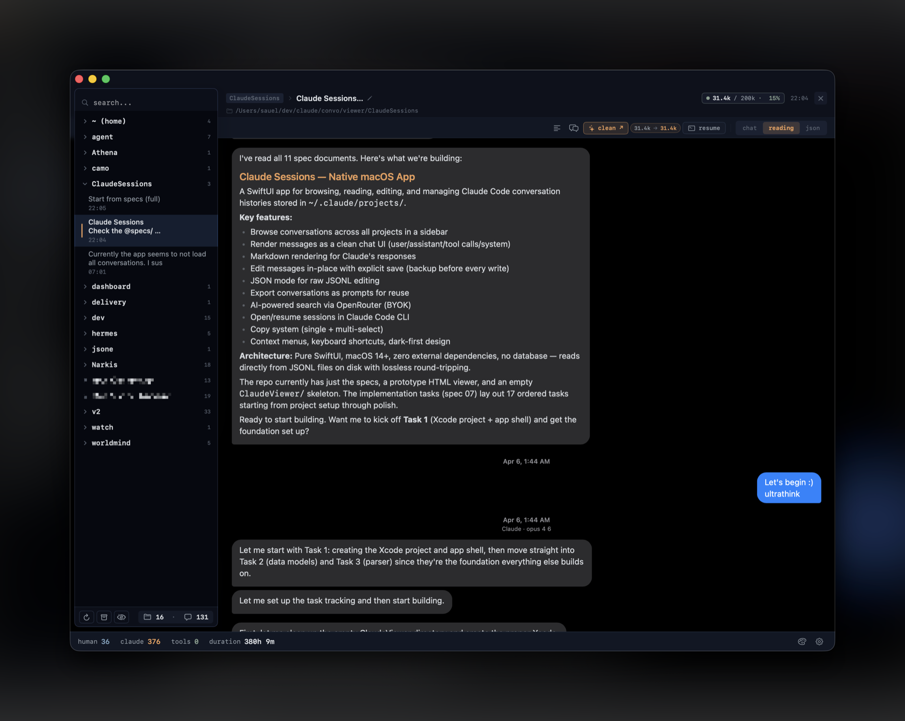
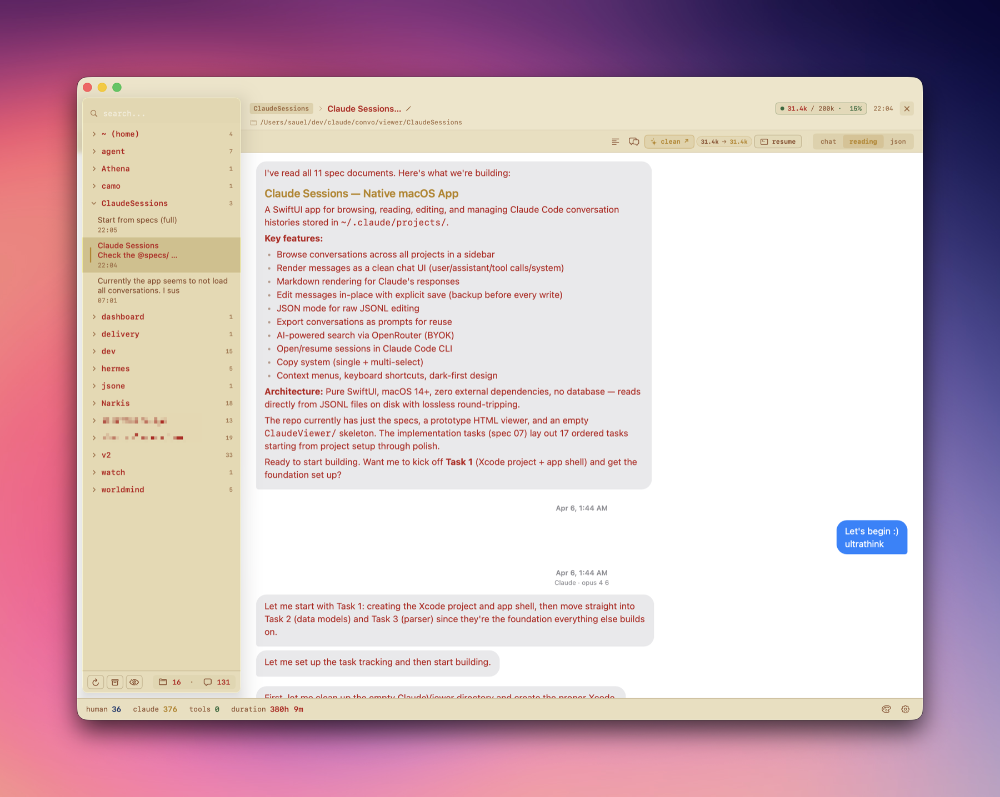
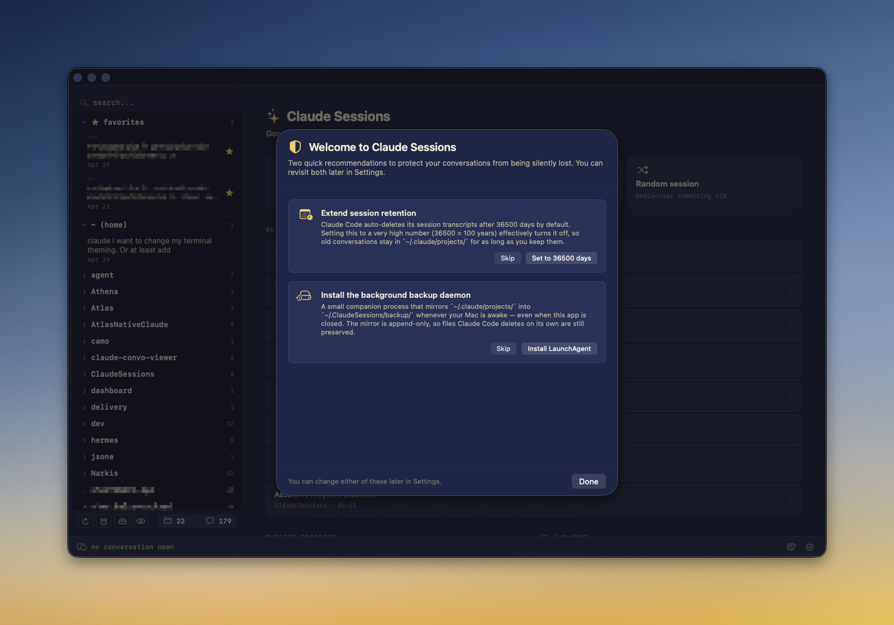

<p align="center">
  
</p>

<h1 align="center">Claude Sessions</h1>

<p align="center">
  A native macOS command center for Claude Code conversations.
</p>

<p align="center">
  <a href="https://github.com/SignedAdam/ClaudeSessions/actions/workflows/ci.yml"></a>
  
  
  
  
  
</p>

<p align="center">
  
</p>

Claude Code writes everything to JSONL. Good. Then it buries the useful parts under tool calls, snapshots, system events, and cleanup rules.

Claude Sessions makes the archive usable: browse it, search it, favorite it, edit it, export it, protect it, and fork clean continuations back into Claude Code.

The main trick: **clean continuation**. Strip a massive session down to the human ↔ assistant dialogue, keep the parent chain valid, write a fresh resumable JSONL, and open it with `claude --resume`. A million-token working mess can become a 30–40k-token conversation without asking an LLM to summarize your history.

## What it does

- Browse every `~/.claude/projects/*.jsonl` conversation by project.
- Read in Chat, Reading, or raw JSON mode.
- Hide, archive, trash, favorite, rename, and copy sessions.
- Edit user or assistant messages safely: saves fork into a new session; the original survives.
- Supercompact a session into a new Claude Code continuation.
- Export to Markdown, JSON, Codex CLI, or Gemini CLI.
- Continue in-app through `claude -p --resume` when you want one more turn without opening a terminal.
- Protect transcripts with continuous backup plus an optional LaunchAgent daemon.
- Let Claude Code control the app through an optional localhost MCP server.
- Look good doing it: themes, ambient background, iMessage-style view, context metrics.

## Screenshots

<p align="center">
  
  
</p>

<p align="center">
  
</p>

## Install

Download the latest DMG from [Releases](https://github.com/SignedAdam/ClaudeSessions/releases), drag the app to Applications, run it.

Current builds are ad-hoc signed, not notarized. If macOS objects, right-click the app and choose **Open**.

## Build from source

```bash
git clone https://github.com/SignedAdam/ClaudeSessions.git
cd ClaudeSessions
swift run ClaudeSessions
```

For bugs, ideas, and pull requests, see [CONTRIBUTING.md](CONTRIBUTING.md).

## Privacy and safety

- Local-first. Reads Claude Code files from `~/.claude/projects/`.
- No database. No cloud service. No telemetry.
- OpenRouter is optional and only used for AI search if you add a key.
- MCP is disabled by default and binds to `127.0.0.1` only.
- Destructive actions use Archive or macOS Trash where possible.
- Edits fork. They do not overwrite your original session.

## Requirements

- macOS 14+
- Xcode command line tools / Swift 5.9+
- Claude Code CLI for resume, clean continuation, and embedded chat features

## How this was built

Stage 2 of this app — 10 phases of features across backup, MCP, version history, multi-root scanning, subagent indexing — was built across **78 autonomous Claude Code cycles** using a roadmap-driven loop technique.

The roadmap that drove it: [`docs/STAGE_2_ROADMAP.md`](docs/STAGE_2_ROADMAP.md).
The full cycle diary: [`docs/cycles/`](docs/cycles).
The technique extracted: **[claude-loop](https://github.com/SignedAdam/claude-loop)** — the `/loop` prompt, the roadmap schema, and the operational discipline, packaged so it's reusable for any project.

## License

MIT. See [LICENSE](LICENSE).
